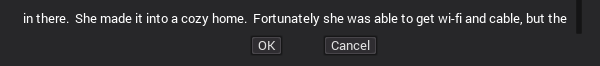

# GUI elements: `ext_controllers`

Extended GUI containers used to position elements in a specific way.

**Category**: `gui`

## Usage

### `left_right_container`

Similar to HBoxContainer, but manages exactly 2 nodes.  It makes one side
a fixed width (based on its minimum size), and the other side expands out.
Both are aligned based on their side (first node is aligned to the left margin,
the second node to the right margin).

To add the container into the node tree, add the node as a "Container" type,
then, at the bottom of the Inspector properties for this new object, select the
Script **Load** option, and choose
the `res://bootstrap/gui/containers/left_right_container.gd` file.

The `right_fixed_width` property should be set to `true` to keep the right side
at a fixed width, and resize the left side to fit the rest of the container.
Set the property to `false` to make the left side be fixed.  The size of the
fixed side is determined by the natural "size" value, or the minimum size.

### `split_container`

Manages exactly 2 nodes, which are aligned around the center of the container -
the first element has its right side aligned on the center, and the second
element has its left side aligned on the center.

To add the container into the node tree, add the node as a "Container" type,
then, at the bottom of the Inspector properties for this new object, select the
Script **Load** option, and choose
the `res://bootstrap/gui/containers/split_container.gd` file.

The `separation` property determines how many pixels should split the two
child nodes apart.

### `ok_cancel_swapper`

An extension of the `split_container` that is specially designed around
containing an OK and Cancel button - it must contain exactly 2 nodes named
`OK` and `Cancel`.  The container changes the position of the nodes to match
the value returned by `OS.is_ok_left_and_cancel_right()`.

## Extending

